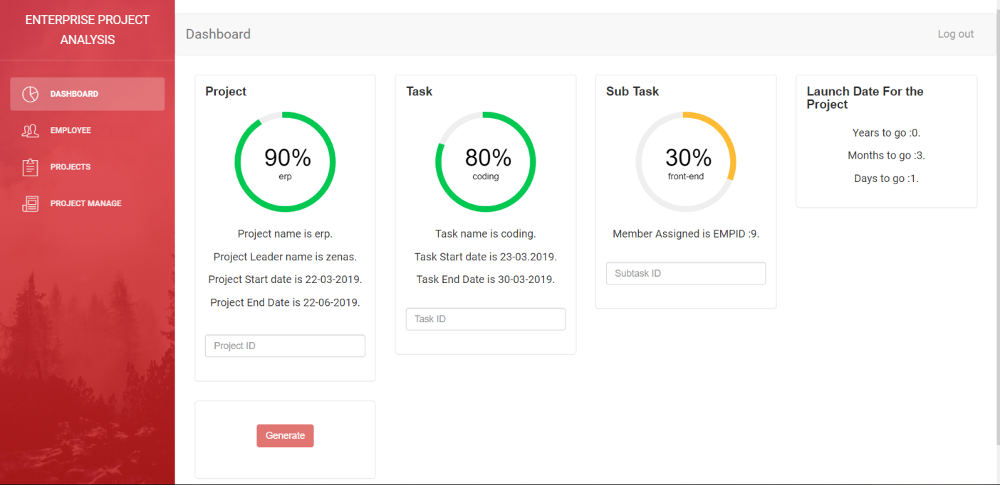
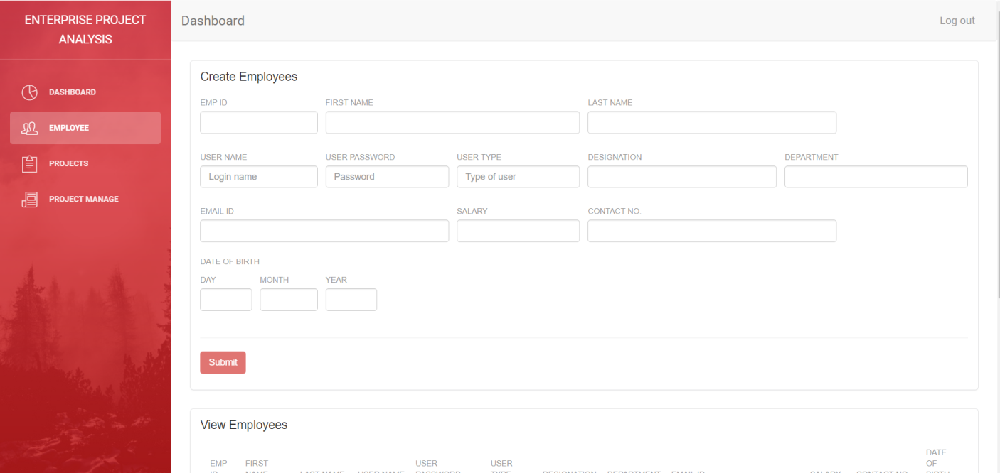
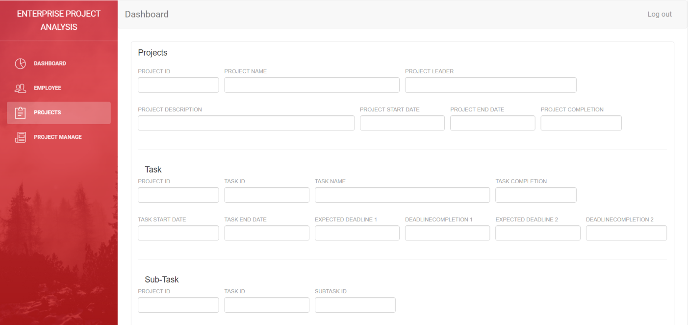
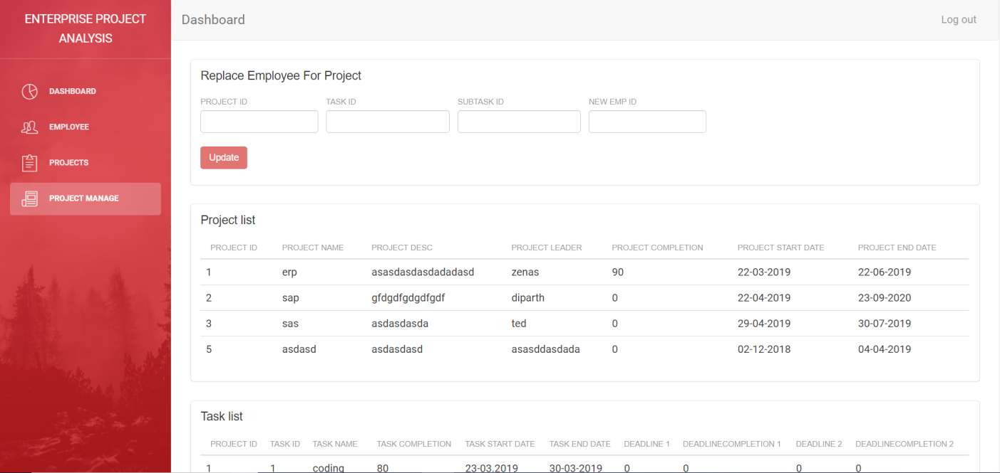
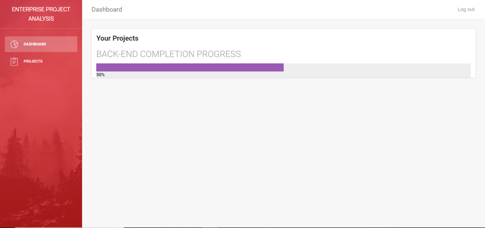
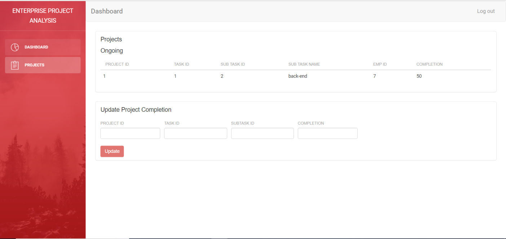

# Enterprise Project Analysis

Enterprise Project Analysis will give the estimated time of completion for a particular project according to the day to day completion of the parts of a project completed by the employee.

The System will consist of two logins, Admin and Employees :
The Admin will be able to either add the project name and its description or check for existing projects and then monitor the status of the project. The admin can add different task such as Planning, Coding, Testing etc. The admin can assign an employee to do different tasks. 

The Employee will receive the assigned work with the help of this system. In the employee login, the employee will receive the task allotted to him & will update the amount(in percentage) of the compeletion of the task which will go to the admin.
 

## Technologies
 * HTML5
 * PHP
 * CSS
 * Bootstrap
 * Javascript
 * JQuery
 * MySQL

## ScreenShots

### Multi-Login Page

### Admin Dashboard

### Employee Details

### Projects

### Replace Employee

### Employee Dashboard

### Employee Projects

